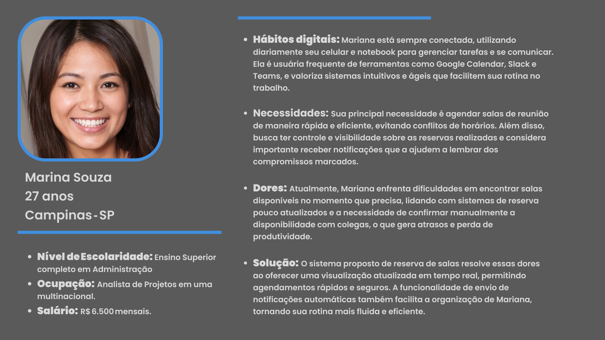
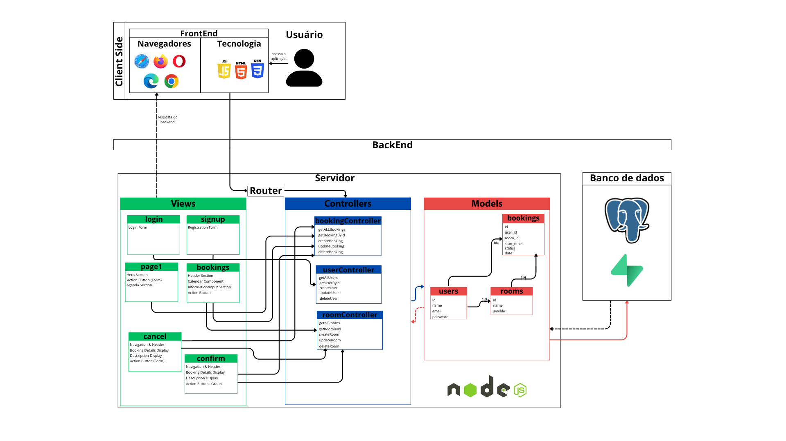
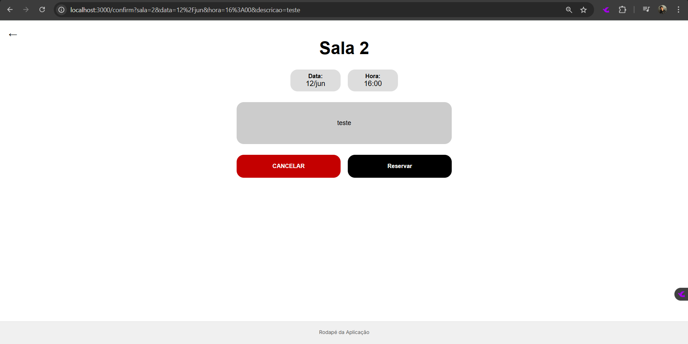

# Web Application Document - Projeto Individual - Módulo 2 - Inteli

**_Os trechos em itálico servem apenas como guia para o preenchimento da seção. Por esse motivo, não devem fazer parte da documentação final._**

## Nome do Projeto

#### Autor do projeto

## Sumário

1. [Introdução](#c1)  
2. [Visão Geral da Aplicação Web](#c2)  
3. [Projeto Técnico da Aplicação Web](#c3)  
4. [Desenvolvimento da Aplicação Web](#c4)  
5. [Referências](#c5)  

<br>

## <a name="c1"></a>1. Introdução

Em ambientes corporativos modernos, a gestão eficiente de espaços é um desafio constante. Com a crescente demanda por reuniões e a necessidade de otimizar o uso das salas, muitos profissionais enfrentam dificuldades em agendar espaços de forma rápida e sem conflitos. O problema é exacerbado pela falta de integração entre os sistemas de reserva, que frequentemente apresentam informações desatualizadas, além da complexidade no processo de confirmação de disponibilidade e a necessidade de interações manuais, o que impacta diretamente na produtividade.

Diante desse cenário, estou desenvolvendo um "Sistema de Reserva de Salas para Agendamentos" com o objetivo de simplificar e agilizar o processo de agendamento de espaços de reunião. A proposta é criar uma plataforma intuitiva e flexível, que permita a visualização em tempo real da disponibilidade das salas, realizando agendamentos rápidos e sem erros.

O foco principal do projeto é proporcionar uma experiência mais fluida e eficiente para os profissionais que lidam com a gestão de salas de reunião de forma constante, permitindo que se concentrem em suas tarefas com mais organização e menos preocupações operacionais. A solução proposta busca não só resolver os problemas atuais, mas também integrar funcionalidades que promovam maior produtividade e colaboração no ambiente corporativo.

---

## <a name="c2"></a>2. Visão Geral da Aplicação Web

### 2.1. Personas

Personas são representações semifictícias de segmentos‑chave de usuários, criadas a partir de dados demográficos, comportamentais e psicográficos coletados por meio de pesquisas de campo, entrevistas e análises de mercado; ao sintetizar motivações, frustrações e objetivos recorrentes em narrativas tangíveis, elas ajudam equipes de design e produto a tomar decisões mais empáticas e fundamentadas, o que, segundo pesquisa do MIT Integrated Design & Management Program, pode elevar em até 20 % a satisfação do usuário final e reduzir em 15 % o retrabalho durante a prototipagem (LEE; FLEMING, 2023).

<div align="center">
  <sub>FIGURA X - Persona </sub><br>
  <br>
  <sup>Fonte: Material produzido pelo autor, 2025</sup>
</div><br>

Portanto, A implementação de um sistema de reserva de salas inteligente vai otimizar o tempo de Mariana, permitindo agendamentos rápidos e sem conflitos. Com controle total sobre as reservas, ela terá mais organização e produtividade, melhorando sua rotina profissional e reduzindo falhas no processo.

### 2.2. User Stories

Identificação | US01
--- | ---
User Story | "Como usuário, quero poder agendar uma sala, para que eu possa reservar um espaço para meus compromissos."
Critério de aceite 1 | CR1: O sistema deve permitir que o usuário selecione uma sala disponível, uma data e um horário.
Critério de aceite 2 | CR2: O sistema deve confirmar a reserva e exibir os detalhes do agendamento.
Critério de aceite 3 | CR3: O sistema deve impedir o agendamento de salas que já estejam reservadas no mesmo horário.

Identificação | US02  
--- | ---  
User Story | "Como usuário, quero visualizar uma tela principal com os meus agendamentos, para que eu possa acompanhar facilmente o que já reservei."  
Critério de aceite 1 | CR1: O sistema deve exibir uma lista dos agendamentos do usuário de forma clara e organizada. 
Critério de aceite 2 | CR2: Cada agendamento deve mostrar informações como sala, data, horário e descrição.
Critério de aceite 3 | CR3: O sistema deve permitir que o usuário identifique rapidamente os próximos agendamentos.

Identificação | US03
--- | ---
User Story | "Como usuário, quero poder cancelar uma reserva de sala, para que eu possa liberar o espaço quando não for mais utilizá-lo."
Critério de aceite 1 | CR1: O sistema deve permitir o cancelamento de reservas futuras diretamente pela interface do usuário.
Critério de aceite 2 | CR2: O usuário deve receber uma confirmação visual ou por e-mail informando que a reserva foi cancelada com sucesso.
Critério de aceite 3 | CR3: A sala cancelada deve retornar ao status de disponível imediatamente após o cancelamento.
Critérios INVEST | A US03 é independente porque trata de uma funcionalidade específica — o cancelamento de uma reserva — que pode ser implementada separadamente das outras, como criação ou edição de reservas. Ela é negociável, pois a forma de cancelamento (por botão, por link, com confirmação extra, etc.) pode ser ajustada conforme feedback dos usuários ou decisões de design. É valiosa porque permite que os usuários liberem espaços que não utilizarão, aumentando a eficiência no uso das salas e evitando bloqueios desnecessários. É estimável, já que envolve interações simples como excluir uma entrada no banco de dados e atualizar a interface, permitindo uma estimativa clara de esforço. É pequena, pois se concentra em apenas uma ação dentro do sistema — cancelar uma reserva específica — sem depender de múltiplos fluxos ou integrações complexas. Por fim, é testável porque os critérios de aceite são objetivos: é possível verificar se a reserva foi realmente cancelada, se o status da sala foi atualizado e se a confirmação foi enviada ao usuário.

---

## <a name="c3"></a>3. Projeto da Aplicação Web

### 3.1. Modelagem do banco de dados

Para o sistema de reserva de salas, foram identificadas três entidades principais: **users**, **rooms** e **bookings**. A modelagem busca garantir integridade dos dados, simplicidade nas consultas e flexibilidade para futuras melhorias.

<div align="center">
  <sub>FIGURA X - Modelo Banco de Dados </sub><br>
  <br>
  <sup>Fonte: Material produzido pelo autor, 2025</sup>
</div>

#### Relacionamentos

- Um **usuário** pode realizar **várias reservas**  
  → Relação **1:N** entre `users` e `bookings`  

- Uma **sala** pode estar associada a **várias reservas**  
  → Relação **1:N** entre `rooms` e `bookings`  

- Um **usuário (admin)** pode cadastrar **várias salas**  
  → Relação **1:N** entre `users` e `rooms`  

### 3.1.1 BD e Models

Nesta seção são descritos os principais Models implementados no sistema web, responsáveis pela interação com o banco de dados via queries SQL executadas pela camada de persistência (`db.query`). Cada Model representa uma entidade do domínio da aplicação e encapsula as operações CRUD.

---

#### Model User

Classe `User` que representa os usuários do sistema.

- **Campos principais:** `id`, `name`, `email`, `password`.
- **Métodos:**
  - `getAllUsers()`: Retorna todos os usuários.
  - `getUserById(id)`: Retorna o usuário com o ID especificado.
  - `createUser(data)`: Cria um novo usuário com os dados fornecidos.
  - `updateUser(id, data)`: Atualiza os dados do usuário pelo ID.
  - `deleteUser(id)`: Deleta o usuário pelo ID.

---

#### Model Room

Objeto `Room` que representa as salas disponíveis para reserva.

- **Campos principais:** `id`, `name`, `available`
- **Métodos:**
  - `getAllRooms()`: Retorna todas as salas cadastradas.
  - `getRoomById(id)`: Retorna uma sala pelo ID.
  - `createRoom(roomData)`: Cria uma nova sala com os dados fornecidos.
  - `updateRoom(id, roomData)`: Atualiza uma sala existente pelo ID.
  - `deleteRoom(id)`: Remove uma sala pelo ID.

---

#### Model Booking

Objeto `Booking` que representa as reservas realizadas.

- **Campos principais:** `id`, `user_id`, `room_id`, `start_time`, `status`, `date`, `description`.
- **Métodos:**
  - `getAllBookings()`: Retorna todas as reservas.
  - `getBookingById(id)`: Retorna uma reserva pelo ID.
  - `createBooking(bookingData)`: Cria uma nova reserva com os dados fornecidos.
  - `updateBooking(id, bookingData)`: Atualiza uma reserva existente pelo ID.
  - `deleteBooking(id)`: Deleta uma reserva pelo ID.

---

<br> Todos os Models usam o módulo `db` para fazer consultas e mudanças no banco de dados do projeto. Isso ajuda a manter o código organizado, porque toda a parte que mexe no banco fica separada do restante do sistema, facilitando o uso e a manutenção.

### 3.2. Arquitetura

Para a elaboração da arquitetura da aplicação web desenvolvida em nosso projeto, optamos pela utilização do padrão arquitetural **MVC (Model-View-Controller)**. Esse padrão promove uma organização mais clara e modular do código, o que facilita tanto o desenvolvimento quanto a manutenção da aplicação ao longo do tempo.

O modelo MVC estabelece uma separação entre três componentes principais:

- **Model (Modelo):** responsável por representar e gerenciar os dados, bem como as regras de negócio da aplicação. É nessa camada que se concentram os processos de manipulação e persistência das informações.

- **View (Visão):** encarregada da apresentação das informações ao usuário, ou seja, da interface gráfica que permite a visualização e interação com os dados disponibilizados pela aplicação.

- **Controller (Controlador):** atua como intermediário entre a View e o Model, sendo responsável por interpretar as ações realizadas pelo usuário, processar as requisições, acionar as regras de negócio e atualizar as interfaces conforme necessário.

Na figura apresentada a seguir, é possível visualizar a estrutura da arquitetura MVC implementada, a qual orientou a divisão de responsabilidades entre as diferentes camadas da aplicação e garantiu maior eficiência no desenvolvimento.

<div align="center">
  <sub>FIGURA X - Arquitetura MVC </sub><br>
  <br>
  <sup>Fonte: Material produzido pelo autor, 2025</sup>
</div>

A arquitetura implementada na aplicação evidencia a adoção eficiente do padrão **MVC (Model-View-Controller)**, que promoveu uma divisão clara de responsabilidades entre as diferentes camadas do sistema: **Views**, **Controllers** e **Models**. Essa separação contribuiu significativamente para a organização e a manutenção do código, permitindo que o desenvolvimento fosse realizado de forma mais estruturada e colaborativa.

Além disso, observa-se a integração eficaz entre o **Client Side** e o **Server Side**. O frontend, desenvolvido com tecnologias como **JavaScript**, **HTML** e **CSS**, proporciona uma interface amigável e responsiva para os usuários, acessível via navegadores modernos. No backend, a utilização do **Node.js** e a modelagem de dados robusta garantem a execução das regras de negócio e a persistência eficiente das informações no banco de dados **PostgreSQL**, acessado via **Supabase**.

A organização dos **Controllers** para diferentes funcionalidades — como agendamentos, usuários e salas — assegura a modularização do backend, facilitando tanto a escalabilidade quanto a manutenção futura do sistema.

Por fim, a arquitetura proposta não apenas atendeu aos requisitos técnicos do projeto, mas também estabeleceu uma base sólida e sustentável para futuras evoluções da aplicação, seja no incremento de novas funcionalidades ou na otimização dos processos existentes.

### 3.3. Wireframes

O wireframe do SalaFlux foi desenvolvido com base nas principais necessidades identificadas na persona Marina Souza e nas user stories levantadas. Como uma profissional que preza por agilidade e organização no trabalho, Marina precisa de um sistema que facilite o agendamento de salas, a lembre sobre suas reservas e permita o cancelamento rápido quando necessário.

<div align="center">
  <sub>FIGURA X - Wireframe mobile de baixa fidelidade </sub><br>
  <br>
  <sup>Fonte: Material produzido pelo autor, 2025</sup>
</div>

<div align="center">
  <sub>FIGURA X - Wireframe desktop de baixa fidelidade </sub><br>
  <br>
  <sup>Fonte: Material produzido pelo autor, 2025</sup>
</div>

O wireframe reflete uma interface clara e funcional, que prioriza a visualização da disponibilidade das salas em tempo real, a criação rápida de novas reservas e o gerenciamento prático dos compromissos. Elementos como reuniões próximas visíveis e botões acessíveis para cancelar ou editar agendamentos foram incorporados para atender diretamente às histórias de usuário.

Assim, o wireframe serve como um guia visual da solução ideal para usuárias como Marina, tornando sua rotina mais fluida, evitando conflitos de horários e melhorando sua produtividade no ambiente de trabalho.

### 3.4. Guia de estilos

Este guia apresenta as diretrizes visuais e funcionais do SalaFlux, focado em oferecer uma experiência intuitiva e acessível. Com uma paleta de cores que transmite confiança e tipografia legível, o projeto prioriza a clareza e a facilidade de uso. Ícones e componentes foram criados para garantir agilidade e compreensão, mantendo a identidade consistente em toda a plataforma.

<div align="center">
  <sub>FIGURA X - Paleta de cores </sub><br>
  <br>
  <sup>Fonte: Material produzido pelo autor, 2025</sup>
</div>

A paleta de cores do SalaFlux foi selecionada criteriosamente com o intuito de assegurar excelente legibilidade, contraste apropriado e uma identidade visual coerente e profissional.

- Cinza (#C9C9C9): Aplicado em elementos secundários, fundos neutros e bordas, conferindo equilíbrio e suavidade ao design.

- Preto (#000000): Cor predominante para textos e ícones, garantindo contraste máximo e facilidade de leitura.

- Branco (#FFFFFF): Utilizado em fundos e espaços vazios, promovendo clareza, destaque e uma melhor organização visual dos conteúdos.

- Vermelho (#C60000): Empregado em botões de cancelamento ou para indicar estados inativos, servindo como sinalização de atenção e alerta para o usuário.

A combinação dessas cores contribui para uma interface limpa, acessível e funcional, alinhada aos padrões de qualidade e usabilidade do projeto.

<div align="center">
  <sub>FIGURA X - Tipografia </sub><br>
  <br>
  <sup>Fonte: Material produzido pelo autor, 2025</sup>
</div>

A tipografia adotada no SalaFlux é a fonte Inter, escolhida por sua excelente legibilidade e versatilidade em ambientes digitais. A hierarquia tipográfica foi cuidadosamente definida para garantir clareza e organização visual em toda a interface.

- Título 1: Inter Black, 96px — utilizado para destacar títulos principais com alta presença visual.

- Título 2: Inter Black, 48px — empregado em subtítulos que necessitam de destaque, porém com menor impacto que o título principal.

- Heading: Inter ExtraLight, 48px — aplicado em cabeçalhos para proporcionar um contraste elegante e leveza ao design.

- Legenda 1: Inter SemiBold, 24px — destinado a legendas e textos auxiliares que exigem destaque moderado.

- Heading 2: Inter Regular, 36px — usado em subtítulos secundários, mantendo boa legibilidade e equilíbrio visual.

- Legenda 2: Inter SemiBold, 24px — também utilizada para legendas, garantindo consistência e uniformidade na apresentação dos textos.

Essa estrutura tipográfica assegura uma comunicação visual clara, harmoniosa e acessível para os usuários do sistema.

<div align="center">
  <sub>FIGURA X - Botões </sub><br>
  <br>
  <sup>Fonte: Material produzido pelo autor, 2025</sup>
</div>

No SalaFlux, os botões foram projetados para oferecer uma experiência clara e intuitiva, com dimensões e estilos definidos para diferentes contextos de uso.

#### Botões Principais
- Botão Reservar:
Dimensões de 181 x 71 px (ou preenchimento total conforme layout) com fonte Inter SemiBold em 24px. Utilizado para ações primárias, garantindo destaque visual e fácil interação.

- Botão Cancelar:
Dimensões iguais ao botão reservar (181 x 71 px ou fill x fill), também com fonte Inter SemiBold 24px. Destinado a ações de cancelamento, com estilo que transmite alerta ou atenção ao usuário.

- Botão de Seleção:
Dimensões de 163 x 41 px, com fonte Inter Regular em 36px. Utilizado para opções de seleção, combinando legibilidade e espaço adequado para o texto.

#### Estados dos Botões
- Selecionado: Indica a opção ativa ou atualmente escolhida pelo usuário, com destaque visual que sinaliza o estado.

- Inativo: Representa botões desabilitados, que não podem ser clicados ou acionados, normalmente indicados por uma cor ou estilo que transmite indisponibilidade.

Esta padronização garante consistência visual e facilita a navegação e interação do usuário com a plataforma.

### 3.5. Protótipo de alta fidelidade (Semana 05 - opcional)

Um protótipo de alta fidelidade é uma representação interativa do produto, desenvolvido para computadores ou dispositivos móveis, que apresenta uma grande semelhança com o design final em termos de aparência, detalhes e funcionalidades.

Para o projeto SalaFlux, foi elaborado um protótipo em alta fidelidade que simula as principais funcionalidades da aplicação, garantindo uma experiência próxima ao produto final. A seguir, serão apresentadas e explicadas as páginas de maior relevância do protótipo. O trabalho completo está disponível no link abaixo:

[Acesse o protótipo completo aqui](https://www.figma.com/design/ZuDVO9MHV1Mxjs58jzgyUt/SalaFlux?node-id=61-92&p=f&t=ZOoCmG6qWu4vYcUq-0)


<div align="center">
  <sub>FIGURA X - Página Principal </sub><br>
  <br>
  <sup>Fonte: Material produzido pelo autor, 2025</sup>
</div>

A página inicial do SalaFlux foi projetada com simplicidade e usabilidade em foco. Com um layout clean e poucos botões, a navegação é intuitiva, permitindo que os usuários acessem rapidamente as principais funcionalidades da plataforma sem distrações. Essa abordagem facilita a experiência do usuário, especialmente para quem busca eficiência e agilidade no uso do sistema.

<div align="center">
  <sub>FIGURA X - Página de reservas </sub><br>
  <br>
  <sup>Fonte: Material produzido pelo autor, 2025</sup>
</div>

A página de reservas do SalaFlux foi desenvolvida para oferecer uma experiência prática e eficiente. Ela conta com botões principais para acesso rápido aos horários disponíveis e às salas, além de um calendário integrado que facilita a visualização e seleção das datas. Essa organização permite que os usuários realizem suas reservas de forma ágil e intuitiva, otimizando o uso da plataforma.

### 3.6. WebAPI e endpoints

Web API é um conjunto de endpoints que permitem que diferentes sistemas e aplicações se comuniquem entre si, compartilhando recursos e dados. Os endpoints são organizados em rotas que representam recursos, e utilizam métodos HTTP para operações de CRUD e outras funcionalidades.

#### Tipos de Solicitação (HTTP Methods)
- **GET:** Recupera dados.
- **POST:** Cria um novo recurso.
- **PUT:** Atualiza um recurso existente.
- **PATCH:** Atualiza parcialmente um recurso.
- **DELETE:** Remove um recurso.

### Endpoints da API (routes.js)

#### Usuários (`/users`)

| Método | Endpoint          | Descrição                         | Função Controller       |
|--------|-------------------|---------------------------------|------------------------|
| GET    | `/users`          | Retorna todos os usuários        | `getAllUsers`          |
| GET    | `/users/:id`      | Retorna um usuário pelo ID       | `getUserById`          |
| POST   | `/users`          | Cria um novo usuário             | `createUser`           |
| PUT    | `/users/:id`      | Atualiza um usuário pelo ID      | `updateUser`           |
| DELETE | `/users/:id`      | Deleta um usuário pelo ID        | `deleteUser`           |

---

### Salas (`/rooms`)

| Método | Endpoint          | Descrição                         | Função Controller       |
|--------|-------------------|---------------------------------|------------------------|
| GET    | `/rooms`          | Retorna todas as salas           | `getAllRooms`          |
| GET    | `/rooms/:id`      | Retorna uma sala pelo ID         | `getRoomById`          |
| POST   | `/rooms`          | Cria uma nova sala               | `createRoom`           |
| PUT    | `/rooms/:id`      | Atualiza uma sala pelo ID        | `updateRoom`           |
| DELETE | `/rooms/:id`      | Deleta uma sala pelo ID          | `deleteRoom`           |

---

### Reservas (`/bookings`)

| Método | Endpoint          | Descrição                         | Função Controller       |
|--------|-------------------|---------------------------------|------------------------|
| GET    | `/bookings`       | Retorna todas as reservas        | `getAllBookings`        |
| GET    | `/bookings/:id`   | Retorna uma reserva pelo ID      | `getBookingById`        |
| POST   | `/bookings`       | Cria uma nova reserva            | `createBooking`         |
| PUT    | `/bookings/:id`   | Atualiza uma reserva pelo ID     | `updateBooking`         |
| DELETE | `/bookings/:id`   | Deleta uma reserva pelo ID       | `deleteBooking`         |

---

### 3.7 Interface e Navegação

Nesta seção, detalhamos o desenvolvimento da interface do usuário (frontend) do sistema web "SALAFLUX", com foco na experiência do usuário e na navegação. O objetivo foi criar uma interface intuitiva e responsiva, que permita aos usuários realizar reservas de salas de forma eficiente. O código-fonte do frontend foi desenvolvido utilizando tecnologias web modernas para garantir performance e manutenibilidade.

A página inicial do sistema serve como ponto de entrada principal, exibindo a identidade visual da aplicação ("SALAFLUX") e uma breve descrição. O botão "Reservar" direciona o usuário para o fluxo de agendamento de salas.

<div align="center">
  <sub>FIGURA X - Página Inicial </sub><br>
  <br>
  <sup>Fonte: Material produzido pelo autor, 2025</sup>
</div>

Um destaque desta página é a seção "Minhas reservas", que proporciona uma visão rápida e organizada das reservas existentes do usuário. Como ilustrado na figura, uma reserva individual exibe o nome da sala ("Sala 1"), uma descrição ("111"), e a data e hora do agendamento ("11/jun - 11:00"). Esta seção permite ao usuário ter um controle imediato sobre seus compromissos.

### 3.7.2 Tela de Reserva de Salas

Ao clicar no botão "Reservar" na página inicial, o usuário é direcionado para a tela de reserva. Esta interface foi projetada para facilitar a escolha da data, hora e sala.

<div align="center">
  <sub>FIGURA X - Página Reserva </sub><br>
  <br>
  <sup>Fonte: Material produzido pelo autor, 2025</sup>
</div>

A tela apresenta um calendário intuitivo, permitindo a navegação entre os meses e a seleção da data desejada. O dia atual ("today") é claramente indicado para referência. À direita do calendário, são apresentados os "Horários disponíveis" e as "Salas disponíveis", que são dinamicamente atualizados com base na data selecionada. Há também um campo de texto para que o usuário insira uma "Descrição da reunião", personalizando sua reserva. O botão "Reservar" nesta tela inicia o processo de confirmação da reserva.

### 3.7.3 Tela de Confirmação de Reserva

Após selecionar os detalhes da reserva na tela anterior e prosseguir, o usuário é levado à tela de confirmação (Figura 3). Esta etapa crucial exibe um resumo dos dados da reserva, incluindo a "Sala" escolhida ("Sala 2"), a "Data" ("12/jun") e a "Hora" ("16:00"). A descrição fornecida pelo usuário ("teste") também é exibida para revisão.

<div align="center">
  <sub>FIGURA X - Página Confirmação </sub><br>
  <br>
  <sup>Fonte: Material produzido pelo autor, 2025</sup>
</div>

A tela oferece duas opções claras ao usuário: "CANCELAR", que permite desistir da reserva e retornar à tela anterior, e "Reservar", que finaliza o processo de agendamento, confirmando a criação da reserva no sistema.

### 3.7.4 Tela de Cancelamento de Reserva

Para proporcionar controle total sobre as reservas, o sistema também inclui uma tela dedicada ao cancelamento. Esta tela é acessada quando o usuário opta por cancelar uma reserva existente ou está no processo de confirmação de uma nova reserva e decide não prosseguir.

<div align="center">
  <sub>FIGURA X - Página Cancela </sub><br>
  <br>
  <sup>Fonte: Material produzido pelo autor, 2025</sup>
</div>

A interface exibe novamente os detalhes da reserva em questão: "Sala 2", "Data: 12/jun" e "Hora: 16:00", além da descrição associada ("teste"). O botão "CANCELAR" é proeminentemente exibido, com a finalidade de desfazer a reserva de forma definitiva. Esta etapa garante que o usuário confirme sua intenção de cancelar, evitando ações acidentais.

---

## <a name="c4"></a>4. Desenvolvimento da Aplicação Web (Semana 8)

### 4.1 Demonstração do Sistema Web (Semana 8)

O vídeo demonstrativo do sistema pode ser acessado através do seguinte link:
[Demonstração do SalaFlux]()

O sistema web SalaFlux foi desenvolvido com sucesso, implementando todas as funcionalidades planejadas para facilitar o agendamento e gerenciamento de salas de reunião. A aplicação foi construída seguindo a arquitetura MVC (Model-View-Controller), utilizando Node.js no backend, PostgreSQL (via Supabase) como banco de dados, e HTML/CSS/JavaScript no frontend.

#### Principais Funcionalidades Implementadas:

1. **Sistema de Autenticação**: Permite que usuários façam login e mantenham suas sessões através de cookies.

2. **Página Inicial Personalizada**: Exibe as reservas do usuário logado, proporcionando uma visão rápida dos compromissos agendados.

3. **Sistema de Reservas**: Interface intuitiva com calendário interativo, seleção de horários e salas disponíveis.

4. **Confirmação de Reservas**: Tela de confirmação que exibe um resumo dos detalhes da reserva antes de finalizar.

5. **Cancelamento de Reservas**: Funcionalidade que permite aos usuários cancelar reservas existentes.

#### Aspectos Técnicos Relevantes:

- **Banco de Dados**: Implementação de três tabelas principais (users, rooms, bookings) com relacionamentos adequados.

````sql
CREATE TABLE IF NOT EXISTS users (
  id SERIAL PRIMARY KEY,
  name VARCHAR(100) NOT NULL,
  email VARCHAR(100) UNIQUE NOT NULL,
  password VARCHAR(100) NOT NULL,
);

CREATE TABLE IF NOT EXISTS rooms (
  id SERIAL PRIMARY KEY,
  name VARCHAR(100) NOT NULL,
  available BOOLEAN DEFAULT TRUE,
);

CREATE TABLE IF NOT EXISTS bookings (
  id SERIAL PRIMARY KEY,
  user_id INT NOT NULL REFERENCES users(id),
  room_id INT NOT NULL REFERENCES rooms(id),
  start_time VARCHAR(5) NOT NULL,
  status VARCHAR(20) NOT NULL CHECK (status IN ('ativa', 'cancelada', 'concluída')),
  date DATE NOT NULL,
  description TEXT NOT NULL
);
````

- **API RESTful**: Desenvolvimento de endpoints para todas as operações CRUD necessárias.
```javascript
  router.get('/api/available-rooms', async (req, res) => {
    try {
      const { date, time } = req.query;
      if (!date || !time) {
        return res.status(400).json({ error: 'Data e hora são obrigatórias' });
      }
      const allRooms = await getRooms();
      const bookings = await Booking.getAllBookings();
      const filteredBookings = bookings.filter(booking => {
        const bookingDate = new Date(booking.date).toISOString().split('T')[0];
        let bookingTime = booking.start_time.substring(0, 5);
        return bookingDate === date && bookingTime === time;
      });
      const bookedRoomIds = new Set(filteredBookings.map(booking => booking.room_id));
      const availableRooms = allRooms.filter(room => !bookedRoomIds.has(room.id));
      res.json(availableRooms);
    } catch (err) {
      console.error('Erro ao buscar salas disponíveis:', err);
      res.status(500).json({ error: 'Erro ao buscar salas disponíveis' });
    }
  });
```

- **Validações**: Implementação de verificações para evitar conflitos de agendamento.
  ```javascript
  static async createBooking(data) {
    try {
      const existingBookings = await db.query(
        'SELECT * FROM bookings WHERE room_id = $1 AND date = $2 AND start_time = $3 AND status = $4',
        [data.room_id, data.date, data.start_time, 'ativa']
      );
      
      if (existingBookings.rows.length > 0) {
        throw new Error('Esta sala já está reservada neste horário');
      }
      let formattedStartTime = data.start_time;
      if (typeof data.start_time === 'string' && !data.start_time.match(/^\d{1,2}:\d{2}$/)) {
        const timeMatch = data.start_time.match(/(\d{1,2}):(\d{2})/);
        if (timeMatch) {
          formattedStartTime = `${timeMatch[1].padStart(2, '0')}:${timeMatch[2]}`;
        }
      }
      
      const result = await db.query(
        'INSERT INTO bookings (user_id, room_id, start_time, status, date, description) VALUES ($1, $2, $3, $4, $5, $6) RETURNING *',
        [data.user_id, data.room_id, formattedStartTime, data.status, data.date, data.description]
      );
      return result.rows[0];
    } catch (err) {
      console.error('Erro ao criar reserva:', err);
      throw err;
    }
  }
  ```

O sistema atende completamente às necessidades identificadas na persona Mariana Souza, oferecendo uma solução eficiente para o problema de agendamento de salas, com interface amigável e funcionalidades que otimizam o fluxo de trabalho.

### 4.2 Conclusões e Trabalhos Futuros (Semana 8)

O desenvolvimento do sistema SalaFlux representou uma jornada significativa de aprendizado e aplicação prática de conceitos de desenvolvimento web. Ao concluir esta etapa do projeto, é possível identificar diversos pontos fortes e oportunidades de melhoria para futuras iterações.

#### Pontos Fortes

1. **Arquitetura MVC bem implementada**: A separação clara entre Model, View e Controller permitiu um desenvolvimento organizado e facilitou a manutenção do código.

2. **Interface intuitiva**: O design minimalista e funcional proporciona uma experiência de usuário fluida, com foco nas tarefas essenciais de agendamento.

#### Pontos a Melhorar

1. **Desempenho em consultas complexas**: Algumas consultas ao banco de dados poderiam ser otimizadas para melhorar o tempo de resposta, especialmente em períodos de alta demanda.

2. **Cobertura de testes**: Embora tenham sido implementados testes básicos, uma cobertura mais abrangente de testes unitários e de integração seria benéfica para garantir a estabilidade do sistema.

3. **Feedback visual**: Algumas ações do usuário poderiam ter feedback visual mais claro, como animações ou mensagens de confirmação mais elaboradas.

#### Melhorias Futuras

1. **Sistema de notificações**: Implementar alertas por e-mail ou push notifications para lembrar os usuários de suas reservas próximas.

2. **Integração com calendários externos**: Permitir sincronização com Google Calendar, Microsoft Outlook e outros serviços populares de agenda.

3. **Dashboard administrativo**: Desenvolver uma interface específica para administradores, com relatórios de uso, estatísticas e ferramentas de gestão avançadas.

4. **Reservas recorrentes**: Adicionar a funcionalidade de criar agendamentos que se repetem semanalmente ou mensalmente, facilitando a vida de usuários com compromissos regulares.

5. **Check-in/Check-out**: Implementar um sistema que permita aos usuários confirmar sua presença na sala e liberar o espaço quando saírem antes do horário previsto.

6. **Avaliação de salas**: Permitir que os usuários avaliem as salas após o uso, gerando insights para melhorias na infraestrutura física.

O SalaFlux demonstrou ser uma solução eficaz para o problema de agendamento de salas, atendendo às necessidades identificadas na fase de planejamento. As melhorias propostas não apenas resolveriam as limitações atuais, mas também expandiriam significativamente o valor entregue aos usuários, transformando o sistema em uma ferramenta ainda mais completa para gestão de espaços.

## <a name="c5"></a>5. Referências

LEE, J.; FLEMING, C. Measuring the Impact of Evidence‑Based Personas on Product Development Outcomes. Cambridge, MA: MIT Integrated Design & Management Program, 2023.

---
---
