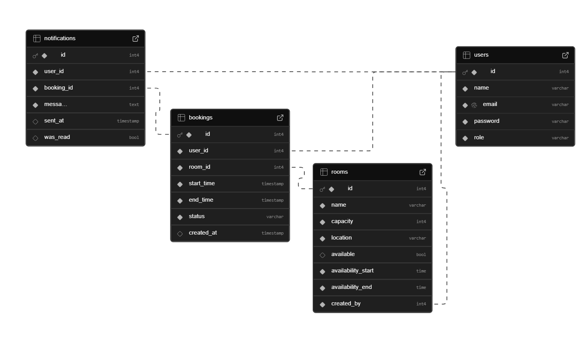

# Web Application Document - Projeto Individual - Módulo 2 - Inteli

**_Os trechos em itálico servem apenas como guia para o preenchimento da seção. Por esse motivo, não devem fazer parte da documentação final._**

## Nome do Projeto

#### Autor do projeto

## Sumário

1. [Introdução](#c1)  
2. [Visão Geral da Aplicação Web](#c2)  
3. [Projeto Técnico da Aplicação Web](#c3)  
4. [Desenvolvimento da Aplicação Web](#c4)  
5. [Referências](#c5)  

 

## 1. Introdução

Em ambientes corporativos modernos, a gestão eficiente de espaços é um desafio constante. Com a crescente demanda por reuniões e a necessidade de otimizar o uso das salas, muitos profissionais enfrentam dificuldades em agendar espaços de forma rápida e sem conflitos. O problema é exacerbado pela falta de integração entre os sistemas de reserva, que frequentemente apresentam informações desatualizadas, além da complexidade no processo de confirmação de disponibilidade e a necessidade de interações manuais, o que impacta diretamente na produtividade.

Diante desse cenário, estou desenvolvendo um "Sistema de Reserva de Salas para Agendamentos" com o objetivo de simplificar e agilizar o processo de agendamento de espaços de reunião. A proposta é criar uma plataforma intuitiva e flexível, que permita a visualização em tempo real da disponibilidade das salas, realizando agendamentos rápidos e sem erros. O sistema também incluirá funcionalidades como notificações automáticas, garantindo que os usuários se mantenham informados sobre os compromissos e evitando sobrecarga de tarefas administrativas.

O foco principal do projeto é proporcionar uma experiência mais fluida e eficiente para os profissionais que lidam com a gestão de salas de reunião de forma constante, permitindo que se concentrem em suas tarefas com mais organização e menos preocupações operacionais. A solução proposta busca não só resolver os problemas atuais, mas também integrar funcionalidades que promovam maior produtividade e colaboração no ambiente corporativo.

---

## 2. Visão Geral da Aplicação Web

### 2.1. Personas

Personas são representações semifictícias de segmentos‑chave de usuários, criadas a partir de dados demográficos, comportamentais e psicográficos coletados por meio de pesquisas de campo, entrevistas e análises de mercado; ao sintetizar motivações, frustrações e objetivos recorrentes em narrativas tangíveis, elas ajudam equipes de design e produto a tomar decisões mais empáticas e fundamentadas, o que, segundo pesquisa do MIT Integrated Design & Management Program, pode elevar em até 20 % a satisfação do usuário final e reduzir em 15 % o retrabalho durante a prototipagem (LEE; FLEMING, 2023).

  FIGURA X - Persona  
   
  Fonte: Material produzido pelo autor, 2025

 

Portanto, A implementação de um sistema de reserva de salas inteligente vai otimizar o tempo de Mariana, permitindo agendamentos rápidos e sem conflitos. Com controle total sobre as reservas e notificações automáticas, ela terá mais organização e produtividade, melhorando sua rotina profissional e reduzindo falhas no processo.

### 2.2. User Stories

Identificação | US01
--- | ---
User Story | "Como usuário, quero poder agendar uma sala, para que eu possa reservar um espaço para meus compromissos."
Critério de aceite 1 | CR1: O sistema deve permitir que o usuário selecione uma sala disponível, uma data e um horário.
Critério de aceite 2 | CR2: O sistema deve confirmar a reserva e exibir os detalhes do agendamento.
Critério de aceite 3 | CR3: O sistema deve impedir o agendamento de salas que já estejam reservadas no mesmo horário.

Identificação | US02  
--- | ---  
User Story | "Como usuário, quero receber notificações sobre minhas reservas, para que eu possa me lembrar dos compromissos agendados e evitar conflitos ou esquecimentos."  
Critério de aceite 1 | CR1: O sistema deve enviar uma notificação antes do horário da reserva, informando o local, data e hora.  
Critério de aceite 2 | CR2: O usuário deve ser notificado também em caso de alterações ou cancelamentos na reserva.  
Critério de aceite 3 | CR3: As notificações devem ser enviadas por e-mail e/ou exibidas dentro do sistema, conforme preferência do usuário.  

Identificação | US03
--- | ---
User Story | "Como usuário, quero poder cancelar uma reserva de sala, para que eu possa liberar o espaço quando não for mais utilizá-lo."
Critério de aceite 1 | CR1: O sistema deve permitir o cancelamento de reservas futuras diretamente pela interface do usuário.
Critério de aceite 2 | CR2: O usuário deve receber uma confirmação visual ou por e-mail informando que a reserva foi cancelada com sucesso.
Critério de aceite 3 | CR3: A sala cancelada deve retornar ao status de disponível imediatamente após o cancelamento.
Critérios INVEST | A US03 é independente porque trata de uma funcionalidade específica — o cancelamento de uma reserva — que pode ser implementada separadamente das outras, como criação ou edição de reservas. Ela é negociável, pois a forma de cancelamento (por botão, por link, com confirmação extra, etc.) pode ser ajustada conforme feedback dos usuários ou decisões de design. É valiosa porque permite que os usuários liberem espaços que não utilizarão, aumentando a eficiência no uso das salas e evitando bloqueios desnecessários. É estimável, já que envolve interações simples como excluir uma entrada no banco de dados e atualizar a interface, permitindo uma estimativa clara de esforço. É pequena, pois se concentra em apenas uma ação dentro do sistema — cancelar uma reserva específica — sem depender de múltiplos fluxos ou integrações complexas. Por fim, é testável porque os critérios de aceite são objetivos: é possível verificar se a reserva foi realmente cancelada, se o status da sala foi atualizado e se a confirmação foi enviada ao usuário.

---

## 3. Projeto da Aplicação Web

### 3.1. Modelagem do banco de dados

Para o sistema de reserva de salas, foram identificadas três entidades principais: **users**, **rooms** e **bookings**. A modelagem busca garantir integridade dos dados, simplicidade nas consultas e flexibilidade para futuras melhorias.

  FIGURA X - Modelo Banco de Dados  
   
  Fonte: Material produzido pelo autor, 2025

#### Relacionamentos

- Um **usuário** pode realizar **várias reservas** → relação 1:N entre `users` e `bookings`.
- Uma **sala** pode estar associada a **várias reservas** → relação 1:N entre `rooms` e `bookings`.

### 3.1.1 BD e Models (Semana 5)
*Descreva aqui os Models implementados no sistema web*

### 3.2. Arquitetura (Semana 5)

*Posicione aqui o diagrama de arquitetura da sua solução de aplicação web. Atualize sempre que necessário.*

**Instruções para criação do diagrama de arquitetura**  
- **Model**: A camada que lida com a lógica de negócios e interage com o banco de dados.
- **View**: A camada responsável pela interface de usuário.
- **Controller**: A camada que recebe as requisições, processa as ações e atualiza o modelo e a visualização.
  
*Adicione as setas e explicações sobre como os dados fluem entre o Model, Controller e View.*

### 3.3. Wireframes (Semana 03 - opcional)

O wireframe do SalaFlux foi desenvolvido com base nas principais necessidades identificadas na persona Marina Souza e nas user stories levantadas. Como uma profissional que preza por agilidade e organização no trabalho, Marina precisa de um sistema que facilite o agendamento de salas, a lembre sobre suas reservas e permita o cancelamento rápido quando necessário.

  FIGURA X - Wireframe de baixa fidelidade  
   
  Fonte: Material produzido pelo autor, 2025

O wireframe reflete uma interface clara e funcional, que prioriza a visualização da disponibilidade das salas em tempo real, a criação rápida de novas reservas e o gerenciamento prático dos compromissos. Elementos como reuniões próximas visíveis e botões acessíveis para cancelar ou editar agendamentos foram incorporados para atender diretamente às histórias de usuário.

Assim, o wireframe serve como um guia visual da solução ideal para usuárias como Marina, tornando sua rotina mais fluida, evitando conflitos de horários e melhorando sua produtividade no ambiente de trabalho.

### 3.4. Guia de estilos (Semana 05 - opcional)

*Descreva aqui orientações gerais para o leitor sobre como utilizar os componentes do guia de estilos de sua solução.*

### 3.5. Protótipo de alta fidelidade (Semana 05 - opcional)

*Posicione aqui algumas imagens demonstrativas de seu protótipo de alta fidelidade e o link para acesso ao protótipo completo (mantenha o link sempre público para visualização).*

### 3.6. WebAPI e endpoints (Semana 05)

*Utilize um link para outra página de documentação contendo a descrição completa de cada endpoint. Ou descreva aqui cada endpoint criado para seu sistema.*  

### 3.7 Interface e Navegação (Semana 07)

*Descreva e ilustre aqui o desenvolvimento do frontend do sistema web, explicando brevemente o que foi entregue em termos de código e sistema. Utilize prints de tela para ilustrar.*

---

## 4. Desenvolvimento da Aplicação Web (Semana 8)

### 4.1 Demonstração do Sistema Web (Semana 8)

*VIDEO: Insira o link do vídeo demonstrativo nesta seção*
*Descreva e ilustre aqui o desenvolvimento do sistema web completo, explicando brevemente o que foi entregue em termos de código e sistema. Utilize prints de tela para ilustrar.*

### 4.2 Conclusões e Trabalhos Futuros (Semana 8)

*Indique pontos fortes e pontos a melhorar de maneira geral.*
*Relacione também quaisquer outras ideias que você tenha para melhorias futuras.*

## 5. Referências

LEE, J.; FLEMING, C. Measuring the Impact of Evidence‑Based Personas on Product Development Outcomes. Cambridge, MA: MIT Integrated Design & Management Program, 2023.

---
---
