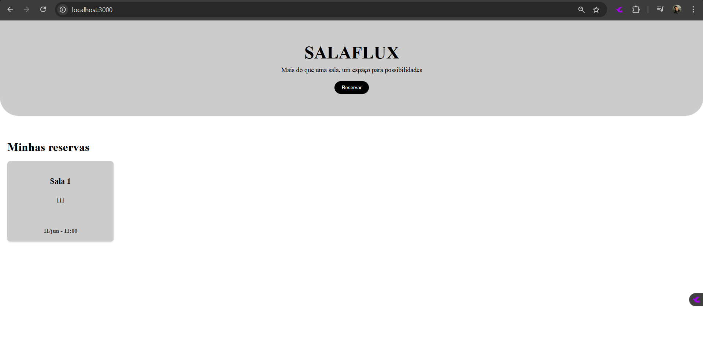
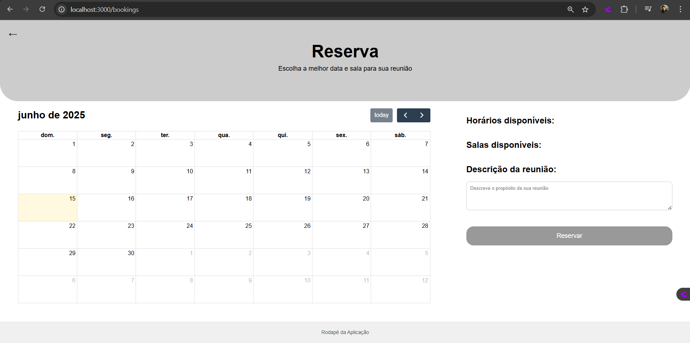
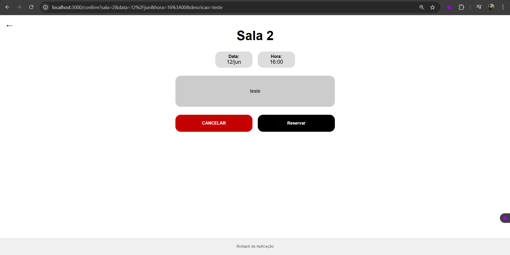

# SalaFlux

## Responsável: 

- <a href="https://www.linkedin.com/in/eduardooliveiralucio">Eduardo de Oliveira Lucio</a>

## 📝 Descrição

O SalaFlux é um sistema web voltado para a reserva otimizada de salas, ideal para ambientes acadêmicos, corporativos ou coworkings. Seu principal objetivo é agilizar o agendamento de espaços, evitando conflitos de horário e melhorando a gestão do tempo e dos recursos disponíveis.

Com uma interface intuitiva, o sistema permite que os usuários agendem uma sala para seus compromissos de forma rápida e simples. Além disso, o SalaFlux oferece uma visão clara das reservas realizadas, facilitando o controle dos agendamentos e evitando conflitos. Caso necessário, os usuários também podem cancelar uma reserva, liberando o espaço para outros.

A proposta do SalaFlux é ser um aliado da produtividade, organizando agendas e garantindo um fluxo de ocupação mais eficiente e transparente.

## 🚀 Funcionalidades

- **Autenticação de Usuários**: Sistema de login e registro para acesso seguro.
- **Visualização de Reservas**: Interface principal que exibe todas as reservas do usuário.
- **Agendamento de Salas**: Processo intuitivo para reservar salas com seleção de data, hora e descrição.
- **Cancelamento de Reservas**: Possibilidade de cancelar agendamentos existentes.
- **Verificação de Disponibilidade**: Sistema automático que evita conflitos de horários.

## 🎬 Demonstração

### Interface do Sistema

<div align="center">
  <p><strong>Página Inicial</strong></p>
  
</div>

<div align="center">
  <p><strong>Tela de Reserva</strong></p>
  
</div>

<div align="center">
  <p><strong>Confirmação de Reserva</strong></p>
  
</div>

### Vídeo Demonstrativo

[Assista à demonstração completa do SalaFlux]()

## 💻 Tecnologias Utilizadas

- **Frontend**: HTML, CSS, JavaScript, EJS (Embedded JavaScript Templates)
- **Backend**: Node.js, Express.js
- **Banco de Dados**: PostgreSQL (via Supabase)
- **Outras Ferramentas**: 
  - Fullcalendar (para interface de calendário)
  - Cookie-parser (para gerenciamento de sessões)
  - Dotenv (para variáveis de ambiente)

## 📁 Estrutura de pastas

```
MVC-BOILERPLATE/
│
├── assets/
├── config/                
│    └── db.js
├── controllers/          
│    └── userController.js
├── documentos/
│    ├── other/
│    └── wad.md
├── models/      
│    └── userModel.js
├── node_modules/
├── routes/             
│    ├── frontRoutes.js
│    └── userRoutes.js
├── scripts/                             
├── services/
│    └── userService.js                     
├── tests/                 
│    ├── userController.test.js
│    ├── userModel.test.js
│    ├── userRoutes.test.js
│    └── userService.test.js
├── views/
├── .env            
├── .gitignore          
├── jest.config.js        
├── package-lock.json     
├── package.json           
├── readme.md           
├── rest.http        
└── server.js         
```

## 💻 Configuração para desenvolvimento e execução do código

Aqui encontram-se todas as instruções necessárias para a instalação de todos os programas, bibliotecas e ferramentas imprescindíveis para a configuração do ambiente de desenvolvimento.

1. Baixar e instalar o node.js: [https://nodejs.org/pt-br/](https://nodejs.org/pt-br/) (versão 16.15.1 LTS)
2. Clone o repositório em questão.
3. No modo administrador, abra o "prompt de comando" ou o "terminal" e, após, abra a pasta raiz do repositório clonado e digite o segundo comando:

```sh
npm install
```

Isso instalará todas as dependências definidas no arquivo <b>package.json</b> que são necessárias para rodar o projeto. Agora o projeto já está pronto para ser modificado. Caso ainda deseje iniciar a aplicação, digite o comando abaixo no terminal:

```sh
npm run dev
```
4. Agora você pode acessar a aplicação através do link http://localhost:3000/

5. O servidor está online.


## 📋 Licença/License

<p xmlns:cc="http://creativecommons.org/ns#" xmlns:dct="http://purl.org/dc/terms/"><a property="dct:title" rel="cc:attributionURL" href="https://github.com/duardoozz/Projeto-Individual-Integrado/tree/main">SalaFlux</a> by <a rel="cc:attributionURL dct:creator" property="cc:attributionName" href="https://github.com/duardoozz/Projeto-Individual-Integrado/tree/main">INTELI, Eduardo de Oliveira Lucio</a> is licensed under <a href="https://creativecommons.org/licenses/by/4.0/?ref=chooser-v1" target="_blank" rel="license noopener noreferrer" style="display:inline-block;">Creative Commons Attribution 4.0 International</a></p>
